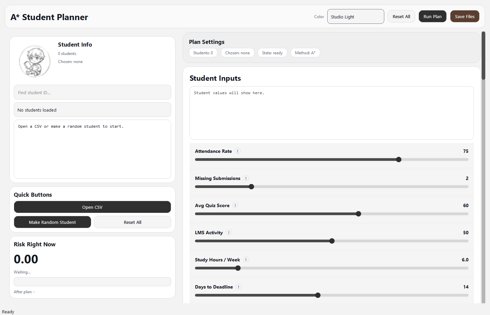
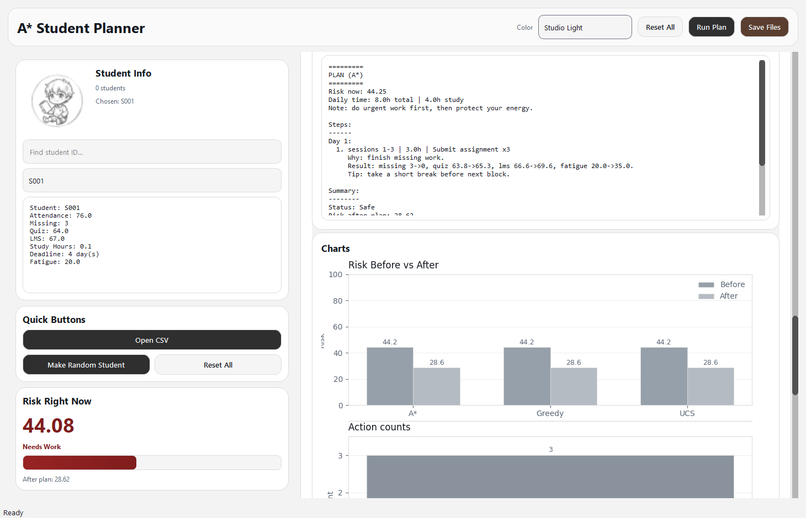

# A* Student Planner

Simple desktop app to build student recovery plans and compare `A*`, `Greedy`, and `UCS`.

## App Screenshots

### Main screen


### Results screen (plan + charts)


## Start the app

### Windows (PowerShell / CMD)
```powershell
.\start
```

### macOS / Linux / Git Bash
```bash
./start
```

The start command is smart:
- creates `.venv` if missing
- installs missing packages only when needed
- runs the app

## How to use

1. Click **Open CSV**.
2. Pick your file (you can use `data/STUDEN_1.CSV`).
3. Select a student.
4. Click **Make Recovery Plan**.
5. Read the output in **Plan Steps** and **Charts**.
6. Optional: click **Run 3 What-if Cases**.

## CSV fields

Required columns:
- `attendance_rate`
- `missing_submissions`
- `avg_quiz_score`
- `lms_activity`
- `study_hours_per_week`
- `days_to_deadline`

Optional columns:
- `student_id`
- `fatigue`
- `available_hours_per_day`

## Quick troubleshooting

- If `./start` is blocked on Unix:
  ```bash
  chmod +x start
  ./start
  ```
- If Python is not found, install Python 3 and run start again.
